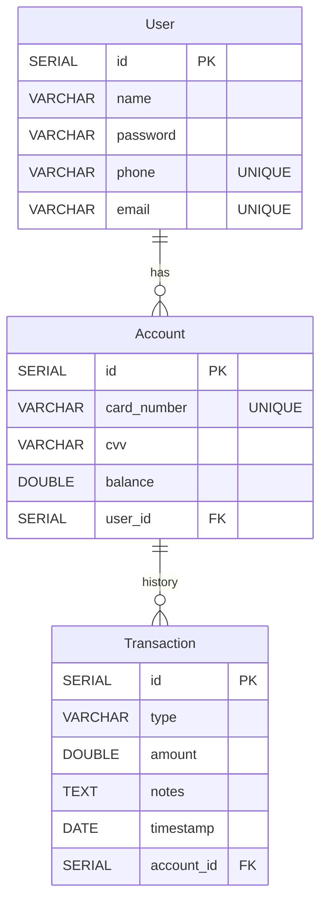
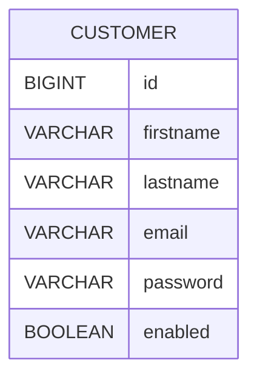
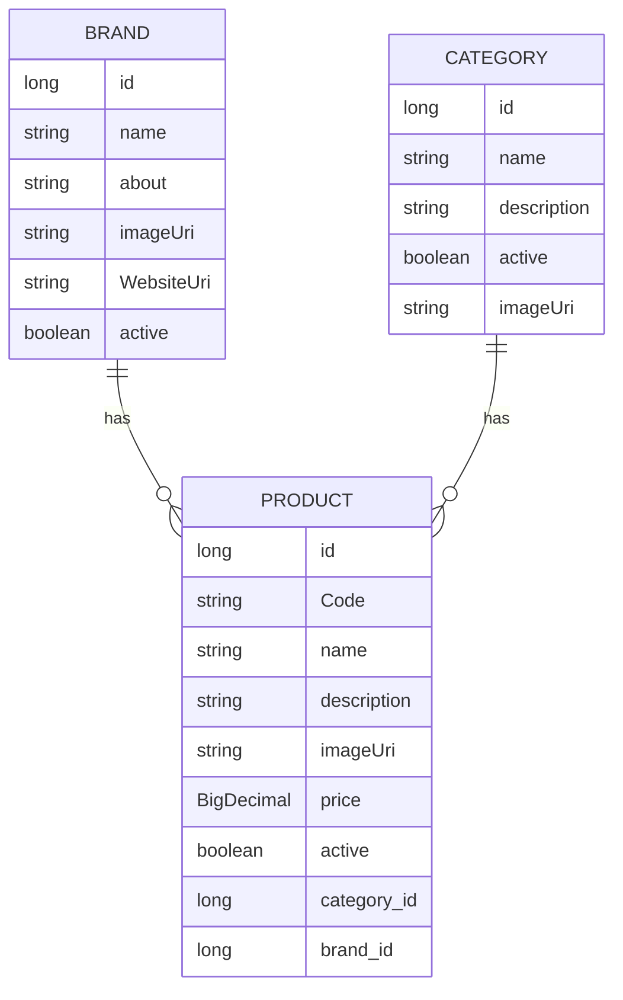
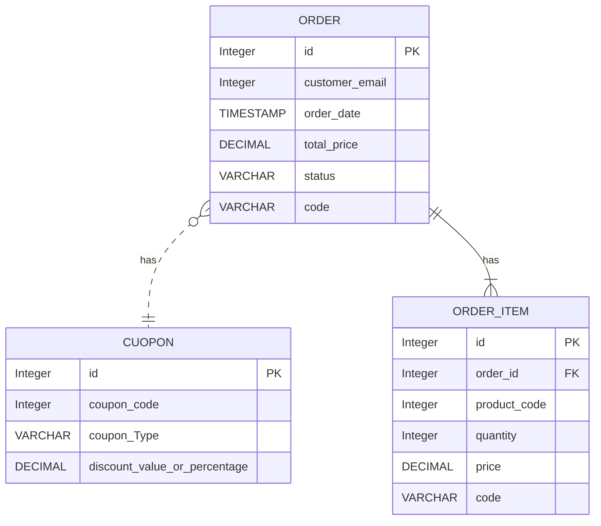
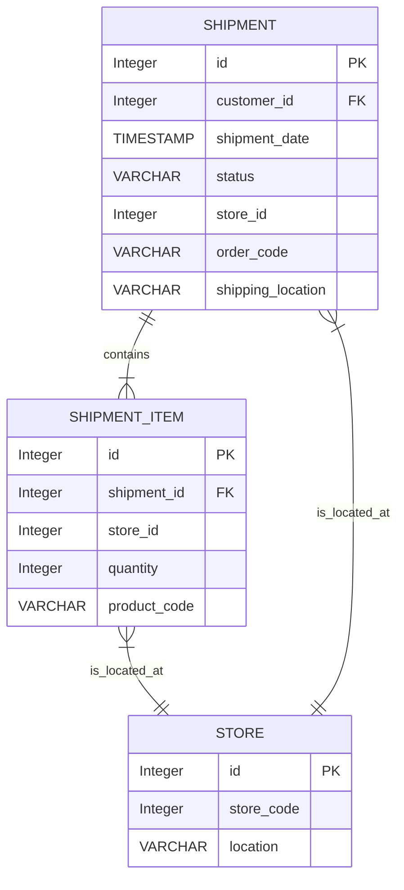
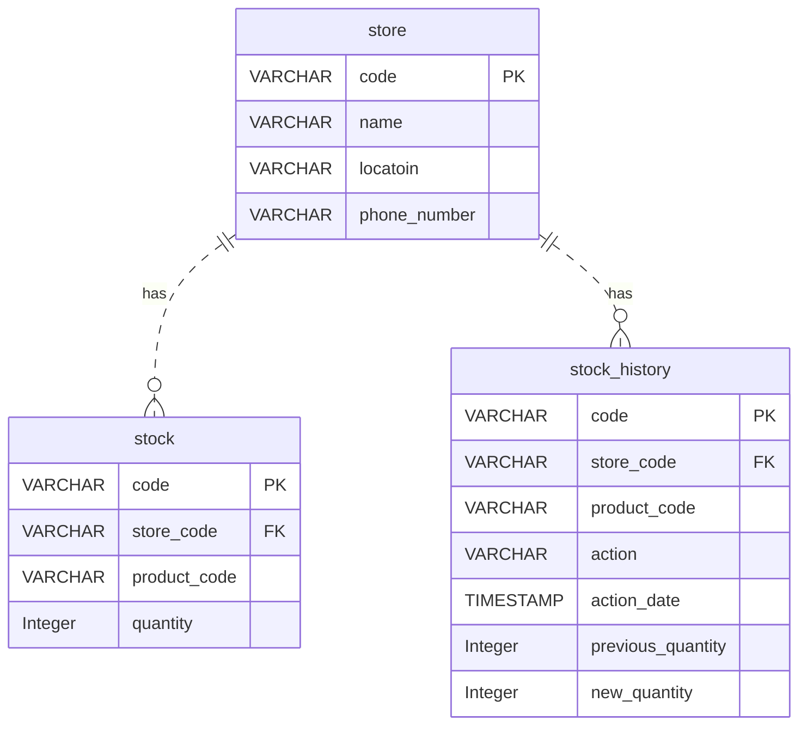

# Welcome to The Squad! 👋🏻

We are a group of passionate software engineers who are interested in building scalable and robust software systems.

Our mission is to simulate builing a microservices architecture e-commerce app.

## About the team

[@Muhammad Saad](https://github.com/muhammad-saad-01)

[@Abdulrahman Essam](https://github.com/orgs/Null-Pointer-Squad/people/horus208)

[@Mohamed Eid](https://github.com/Mohammed-eid35)

[@Mohammed Samih](https://github.com/Muhammed-Sameih)

[@Abdelaziz Ashraf](https://github.com/abdelaziz-ashraf)

[@Mohamed Taha](https://github.com/MohamedTahaCS)

Let's get started! and have a look at what we are trying to build! 🎉.

# E-Commerce Microservices Platform

we are simulating building an e-commerce platform using microservices architecture. We are building a platform that allows customers to browse products, add them to their cart, and purchase them and track thier shippment. We are also building a platform that allows admins to manage products, categories, brands, stors stock and coupons.

## 1. Bank Management System

The Bank Management System is a standalone web-based application developed using Spring Boot that aims to streamline various banking operations. This system offers features to manage customer accounts and perform transactions. (we are using this system to simulate the payment process in our e-commerce platform)

Check out the full details here 👉🏻 [Bank Management System README file.](https://github.com/Null-Pointer-Squad/bank-management-system-springboot)

and here is the ERD for the database used in this service:

## 2. Admin Management and Authentication Service

This service is an admin management and authentication service built using Spring Boot, Spring Security, and JSON Web Tokens (JWT). It provides a secure and efficient way to manage admin users, authenticate them using email and password, and generate JWTs for accessing protected resources. Additionally, admins have the ability to add other admins and activate or deactivate their accounts.
(we are using this system to simulate the admin management and authentication process in our e-commerce platform)

Check out the full details here 👉🏻 [Admin Management and Authentication Service README file.](https://github.com/Null-Pointer-Squad/admin-service-api)

and here is the ERD for the database used in this service:

## 3. Product Catalog API Service

This service is built for managing a product catalog [adding, updating, deleting, and retrieving products] for an E-Commerce Application. (we are using this system to simulate the product catalog management process in our e-commerce platform)

Check out the full details here 👉🏻 [Product Catalog API README file.](https://github.com/Null-Pointer-Squad/Product-Catalog-API)

and here is the ERD for the database used in this service:

## 4. Orders API Service

The Orders API Service is an important component of our e-commerce platform, designed to efficiently handle the creation, management, and processing of our customers' orders. And it encapsulates order-related functionalities.

Check out the [Orders API README file.](https://github.com/Null-Pointer-Squad/OrderAPIs)

and here is the ERD for the database used in this service:

## 5. Shipping API

The Shipping Service is an important component of our e-commerce platform, designed to efficiently manage the shipping and delivery aspects of our customers' orders. And it encapsulates shipping-related functionalities (we are using this system to simulate the shipping management process in our e-commerce platform)

Check out the full details here 👉🏻 [Shipping API README file.](https://github.com/Null-Pointer-Squad/ShippingAPIs)

and here is the ERD for the database used in this service:

## 6. Coupons Service API

Check out the full details here 👉🏻 [Coupons Service API README file.](https://github.com/Null-Pointer-Squad/CouponsServiceAPI)

## 7. Store Service

The Store Service is a key part of our e-commerce platform, focused on managing all store operations, stock inventory, and stock history. (we are using this system to simulate the shipping management process in our e-commerce platform)

Check out the full details here 👉🏻 [Store Service README file.](https://github.com/Null-Pointer-Squad/store_service)

and here is the ERD for the database used in this service:

---

> Questions? Here’s how to reach us: [Notion](https://muhammad-saad-01.notion.site/Leave-your-comment-e47baf8aed714e44813bcf7d15a9589e?pvs=4)
